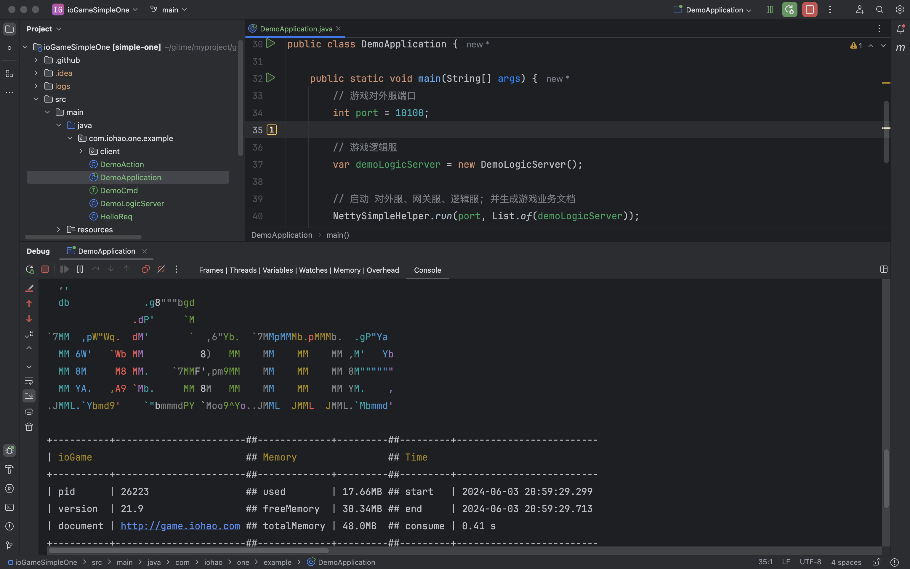
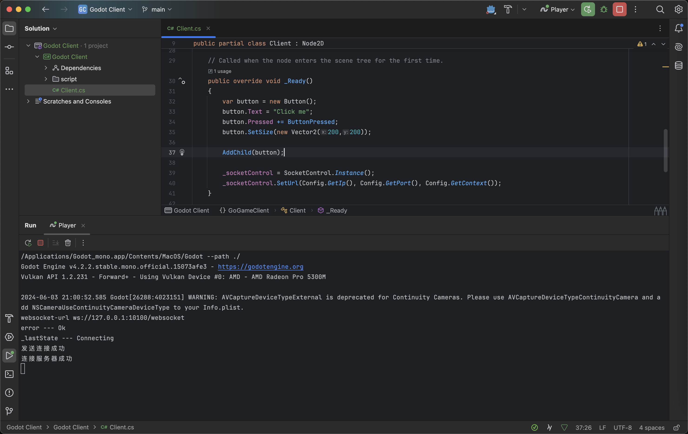
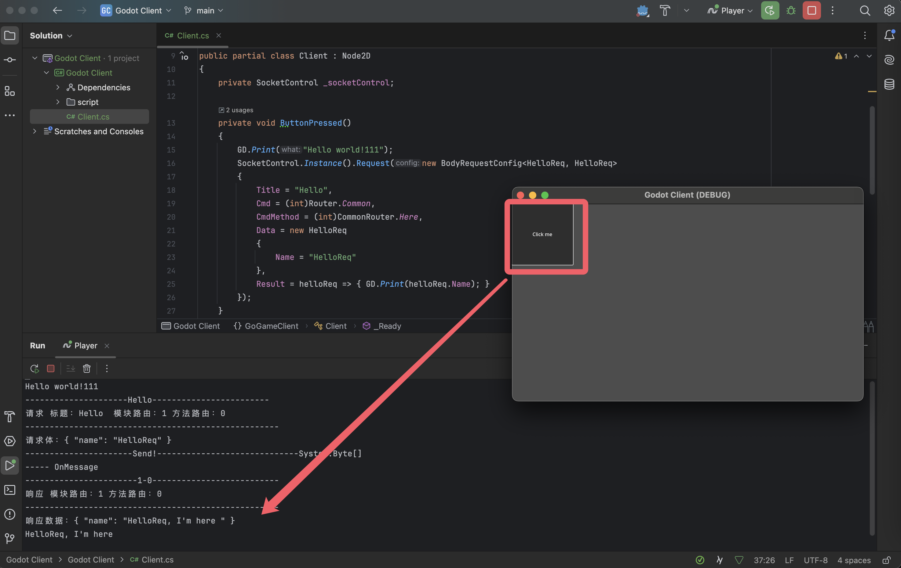
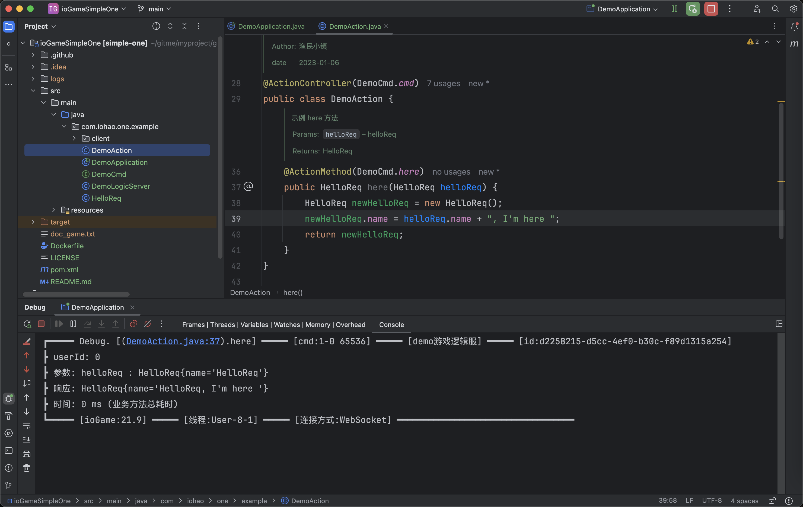

## 介绍

> 示例（前端部分）由热心市民提供，贡献者：[小龙同学](https://gitee.com/gghnoit)。


[Godot](https://godotengine.org/)、Netty、Protobuf、C#、[ioGame](https://www.yuque.com/iohao/game) 网络通信联调。

- 游戏客户端使用的是 Godot，使用的 C# 开发，与服务器通信使用的是 Protobuf。
- 服务器使用 netty，双方使用 Protobuf 进行网络通信。
- 网络通信使用 webSocket

<br>

## 目录介绍

```css
.
├── README.md
├── godot-client  ## godot 客户端
└── ioGameSimpleOne ## netty 服务器
```

<br>

## 启动

### 1、首先启动 netty 游戏服务器 

> 启动类 DemoApplication.java



<br>

### 2、启动 godot 

> 启动 godot。
>
> 这里的工具使用的是 Rider，工具安装 Godot support 插件后就能正常运行了。



<br>

> 点击按钮（Click me），向游戏服务器发送请求。
>
> 控制台中打印了服务器响应的数据。



<br>

### 3、服务器接收请求

> 游戏服务器接收到请求后的打印信息。




## 小结

游戏客户端使用的是 Godot，使用的 C# 开发，与服务器通信使用的是 Protobuf。


游戏服务器使用的是 Netty，ioGame。

> [ioGame 网络游戏服务器框架 (yuque.com)](https://www.yuque.com/iohao/game)

- ioGame 是基于 java netty 的高性能游戏服务器框架，是一款真.轻量级的网络编程框架。

- ioGame 源码完全开放、最新文档阅读完全开放；使用完全自由、免费（遵守开源协议）。

- ioGame 是一个轻量级的网络编程框架，适用于网络游戏服务器、物联网、内部系统及各种需要长连接的场景；


你是否想要开发一个高性能、稳定、易用、自带负载均衡、避免类爆炸设计、可跨进程跨机器通信、集群无中心节点、集群自动化、有状态多进程的分布式的网络编程服务器呢？如果是的话，这里向你推荐一个由 java 语言编写的网络编程框架 ioGame。下面将会从多个方面来对框架做一些简单的介绍。


ioGame 特点：
- 无锁异步化、事件驱动的架构设计；轻量级，无需依赖任何第三方中间件或数据库就能支持集群、分布式
- 通过 ioGame 可以很容易的搭建出一个集群无中心节点、集群自动化、多进程的分布式游戏服务器
- 包体小、启动快、内存占用少、更加的节约、无需配置文件、提供了优雅的路由访问权限控制
- 可同时支持多种连接方式：WS、UDP、TCP...等；框架已支持全链路调用日志跟踪特性
- 让开发者用一套业务代码，能轻松切换和扩展不同的通信协议：Protobuf、JSON
- 近原生的性能；业务框架在单线程中平均每秒可以执行 1152 万次业务逻辑
- 代码即联调文档、JSR380验证、断言 + 异常机制 = 更少的维护成本
- 框架具备智能的同进程亲和性；开发中，业务代码可定位与跳转
- 架构部署灵活性与多样性：既可相互独立，又可相互融合
- 可同时与同类型的多个游戏逻辑服通信并得到数据
- 逻辑服之间可相互跨进程、跨机器进行通信
- 支持玩家对游戏逻辑服进行动态绑定
- 能与任何其他框架做融合共存
- 对 webMVC 开发者友好
- 无 spring 强依赖
- 零学习成本


